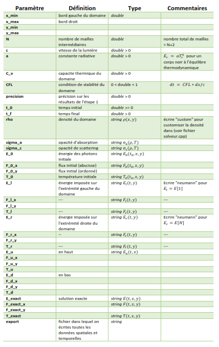
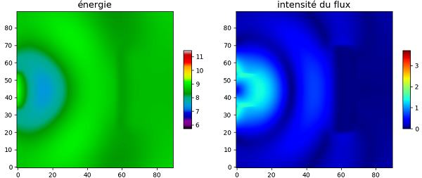

# Transfert Radiatif: Problème Inverse 2D (MOCO)

### Objectif
Résolution du problème de propagation de la lumière par la méthode des volumes finis en 2D et apprentissage de la densité par un réseau de neurones.

### Documents
- Indications et travail à faire: `doc/guidelines/projetM1.pdf`  
- Rapport de stage en français: `Rapport.pdf` ou `doc/fr/rapport.pdf`  
- Rapport en anglais: `doc/eng/report.pdf`  
- Présentation et résumé: `Presentation.pdf` ou `doc/presentation/main.pdf`  

## __1ère partie: Résolution de l'EDP__    
_Les commandes indiquées sont à exécuter à partir du répertoire racine du projet._

### Compilation
La première option est d'utiliser CMake:   
- __`rm -rf build`__
- __`cmake -H. -Bbuild`__  
- __`cmake --build build`__  

La deuxième option nécessite Docker et Visual Studio Code.  
- Installer __Docker__  
- Installer __VSCode__  
- Installer l'extension Docker dans VSCode  
- Ouvrir le projet sous un conteneur dans VSCode (le fichier __Dockerfile.ci__ est déjà configuré)  
- Compiler le code à l'aide de __CMake__  
Cette dernière étape peut être facilitée par l'utilisation des extensions __CMake__ et __CMake Tools__ sous le conteneur dans VSCode. Il faudra probablement "__clean reconfigure__" le projet avant de "__build__".

### Exécution
- Pour une simple exécution : __`build/transfer src/config/simu.cfg`__ 
- Pour faire une série de simulations : __`bash src/simu/data_dump.sh`__ 

#### Format des fichiers de configuration (`data/img/config.pdf`)   

### Formats possibles de sauvegarde
- __`data/df_simu.csv`__: exemple de fichier CSV pour les signaux exportés.
- __`data/part_1.sds`__: exemple de fichier binaire SDS (source-densité-signal) pour la sauvegarde d'une série de simulations.

### Visualisation des résultats
- [__`src/notebook/visualisation_2d.ipynb`__](https://github.com/desmond-rn/projet-inverse-2d/blob/master/src/notebook/visualisation_2d.ipynb)
  

## __2ème partie: Reconstruction de la densité__   
### Préparation des données  
- Lecture du format CSV: [`src/notebook/sauvegarde_2d.ipynb`](https://github.com/desmond-rn/projet-inverse-2d/blob/master/src/notebook/sauvegarde_2d.ipynb)
- Lecture du format SDS: [`src/notebook/format_binaire.ipynb`](https://github.com/desmond-rn/projet-inverse-2d/blob/master/src/notebook/format_binaire.ipynb).  

### Apprentissage  
- Régression sur un maillage 28x28 et sigma_a=sigma_c=rho*T (régression principale, aussi appelée __Regression3.ipynb__ comme mentionné dans le rapport): [`src/notebook/Regression.ipynb`](https://github.com/desmond-rn/projet-inverse-2d/blob/master/src/notebook/Regression.ipynb)  
- Régression sur un maillage 28x28 et sigma_a=sigma_c=T*(10*rho)^3: [`src/notebook/Regression28x28.ipynb`](https://github.com/desmond-rn/projet-inverse-2d/blob/master/src/notebook/Regression28x28.ipynb)  
- Régression sur un maillage 90x90 et sigma_a=sigma_c=rho*T: [`src/notebook/Regression90x90.ipynb`](https://github.com/desmond-rn/projet-inverse-2d/blob/master/src/notebook/Regression90x90.ipynb)  
- Classification : [`src/notebook/classification.ipynb`](https://github.com/desmond-rn/projet-inverse-2d/blob/master/src/notebook/Classification.ipynb)  

## Ressources utilisées:
- __muParser__: pour transformer des expressions en fonctions: [Exemple](https://beltoforion.de/article.php?a=muparser&s=idExample#idExample) - [Instructions](https://beltoforion.de/article.php?a=muparser&p=building)
